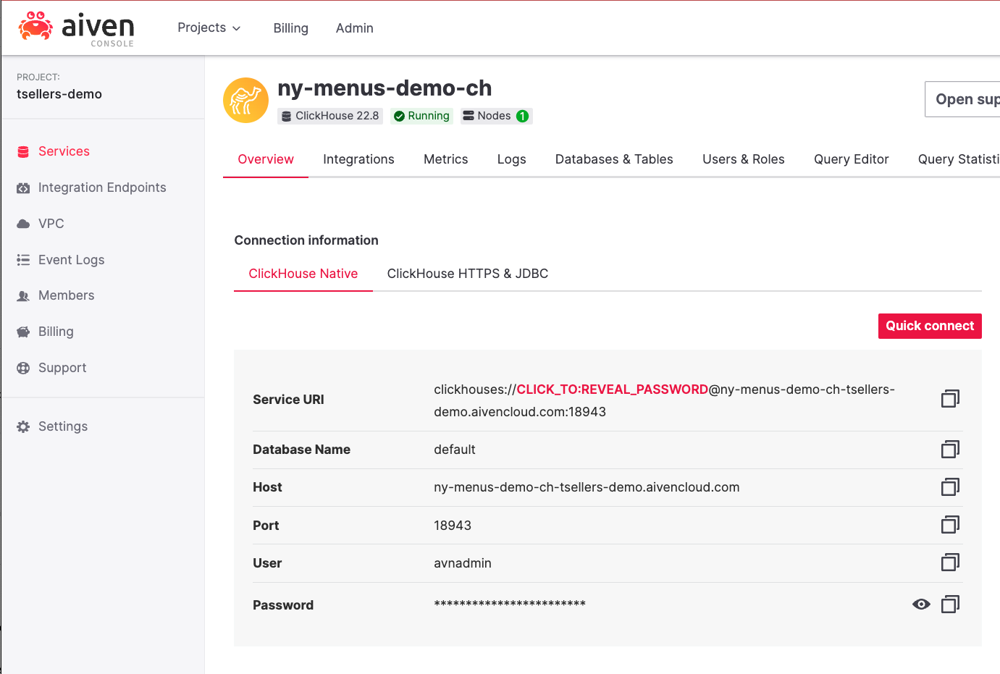

# Clickhouse Demo - NY Taxi Data

This demo is built following the instructions in the [Clickhouse](https://clickhouse.com/docs/en/getting-started/example-datasets/menus) documentation. 

*The terraform script included in this project will create a file that has the credentials for this database in the data directory!! It is a demo, think carefully friends*

## Pre-requisites
This was built and tested on an Apple Silicon mac, it hasn't really be valiated on anything else. 

* [Clickhouse binary](https://clickhouse.com/docs/en/install)
* [Terraform](https://developer.hashicorp.com/terraform/tutorials/aws-get-started/install-cli)
* [Aiven CLI](https://docs.aiven.io/docs/tools/cli)
* Aiven account and an [authentication token](https://docs.aiven.io/docs/platform/howto/create_authentication_token)

The full details of what I am running at time of writing  
```
ClickHouse 22.9.1.1497 with revision 54466

$> terraform -version
Terraform v1.1.9
on darwin_arm64

$> avn --version 
aiven-client 2.14.8

$> system_profiler SPSoftwareDataType SPHardwareDataType
Software:

    System Software Overview:

      System Version: macOS 13.x 
      Kernel Version: Darwin 22.x

Hardware:

    Hardware Overview:

      Model Name: MacBook Pro
      Model Identifier: MacBookPro18,1
      Chip: Apple M1 Pro
      Total Number of Cores: 10 (8 performance and 2 efficiency)
      Memory: 16 GB
```

## Setup
Once you have downloaded this repository `git clone git@github.com:troysellers/ny-taxi-ch-demo.git`

get the data to work with

```
$> cd ny-taxi-ch-demo/data
$> ./get-data.sh
```

This will end up with 4 different files of data that are going to be imported in Clickhouse in a following step.

## Build the Clickhouse service
Now move into the terraform directory.

```
$> cd ../terraform
$> terraform init
```
This is going to setup the terraform things.. then, run the script. 

If you normally don't YOLO, perhaps `terraform plan` first? 

```
$> terraform apply --auto-approve
```

## Import your data
Move into the data directory 
```
$> cd ../data
```

Run the script that the terraform script would have output for you
```
$> ./create_sh
```


## Query your clickhouse. 
Open the Aiven [console](https://console.aiven.io) to get your credentials for Clickhouse
(If you open the `create_sh` script you will also find this command in that script.) 



Now connect and query away! 

```
$> clickhouse client \
    --host <host> \
    --secure \
    --port <port> \
    --password <password> \
    --user <user> 
```

Firstly, it is good to understand that Clickhouse is probably better suited running denormalised data. 
So let's go ahead and merge the tables we have just loaded into one so it becomes a little easier to work with.

```
CREATE TABLE menu_item_denorm
ENGINE = MergeTree ORDER BY (dish_name, created_at)
AS SELECT
    price,
    high_price,
    created_at,
    updated_at,
    xpos,
    ypos,
    dish.id AS dish_id,
    dish.name AS dish_name,
    dish.description AS dish_description,
    dish.menus_appeared AS dish_menus_appeared,
    dish.times_appeared AS dish_times_appeared,
    dish.first_appeared AS dish_first_appeared,
    dish.last_appeared AS dish_last_appeared,
    dish.lowest_price AS dish_lowest_price,
    dish.highest_price AS dish_highest_price,
    menu.id AS menu_id,
    menu.name AS menu_name,
    menu.sponsor AS menu_sponsor,
    menu.event AS menu_event,
    menu.venue AS menu_venue,
    menu.place AS menu_place,
    menu.physical_description AS menu_physical_description,
    menu.occasion AS menu_occasion,
    menu.notes AS menu_notes,
    menu.call_number AS menu_call_number,
    menu.keywords AS menu_keywords,
    menu.language AS menu_language,
    menu.date AS menu_date,
    menu.location AS menu_location,
    menu.location_type AS menu_location_type,
    menu.currency AS menu_currency,
    menu.currency_symbol AS menu_currency_symbol,
    menu.status AS menu_status,
    menu.page_count AS menu_page_count,
    menu.dish_count AS menu_dish_count
FROM menu_item
    JOIN dish ON menu_item.dish_id = dish.id
    JOIN menu_page ON menu_item.menu_page_id = menu_page.id
    JOIN menu ON menu_page.menu_id = menu.id;
```


```
$> select pickup_ntaname, count() as count from trips group by pickup_ntaname order by count desc limit 10


Query id: 1ab0a0cf-fc01-495e-88ec-1060bc9d3653

┌─pickup_ntaname─────────────────────────────┬───count─┐
│ Midtown-Midtown South                      │ 3460770 │
│ Hudson Yards-Chelsea-Flatiron-Union Square │ 1893412 │
│ West Village                               │ 1380513 │
│ Turtle Bay-East Midtown                    │ 1291080 │
│ Upper East Side-Carnegie Hill              │ 1214850 │
│ Airport                                    │  993906 │
│ SoHo-TriBeCa-Civic Center-Little Italy     │  951070 │
│ Murray Hill-Kips Bay                       │  909452 │
│ Upper West Side                            │  893506 │
│ Clinton                                    │  855681 │
└────────────────────────────────────────────┴─────────┘

10 rows in set. Elapsed: 0.108 sec. Processed 19.71 million rows, 21.84 MB (182.08 million rows/s., 201.83 MB/s.)
```

Not bad, processing 19.7 million rows in 100ms. 


